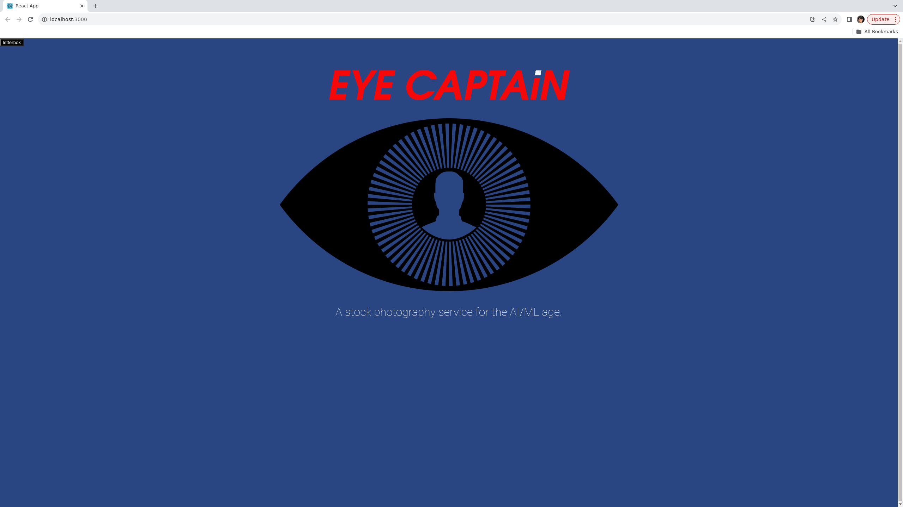

# Pitch Deck React

This project was bootstrapped with [Create React App](https://github.com/facebook/create-react-app).

## About 

This is a version of a pitch deck app, made using React. 

I wrote about it on [JavaScriptPage](https://javascriptpage.com/react-svelte-pitch-deck-app-comparison).

Live demo [here](http://pitch-deck-react.s3-website-us-east-1.amazonaws.com/). Click images to advance.

## Running The App

First, git clone the app.

Then:

npm install

npm start

It should now be available on port 3000 of your app.

Feel free to use and remix under an MIT license.
